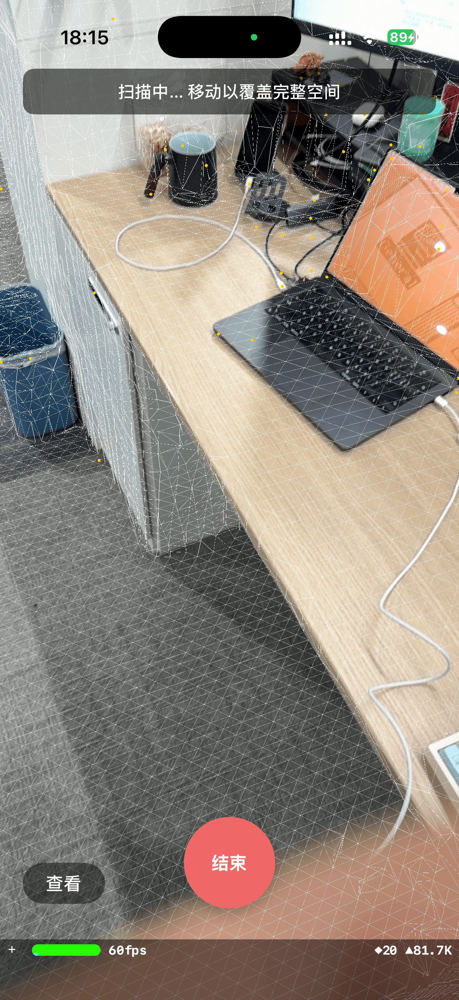
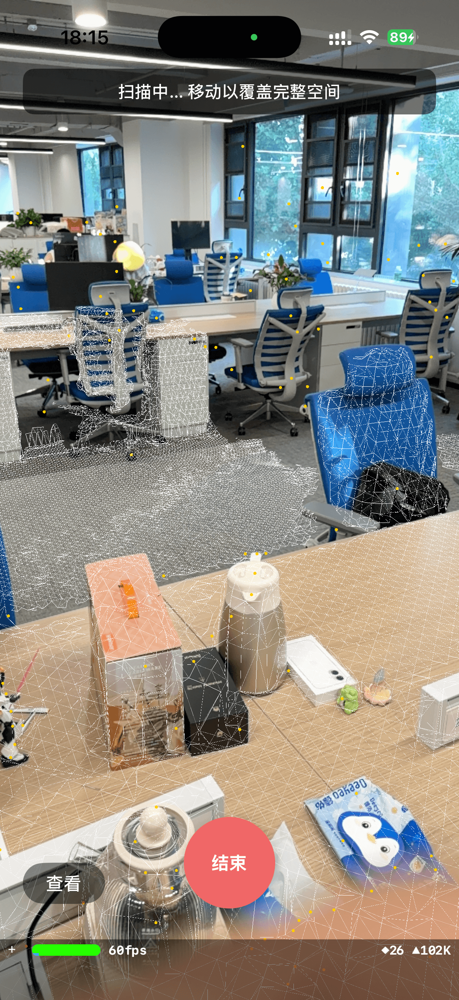
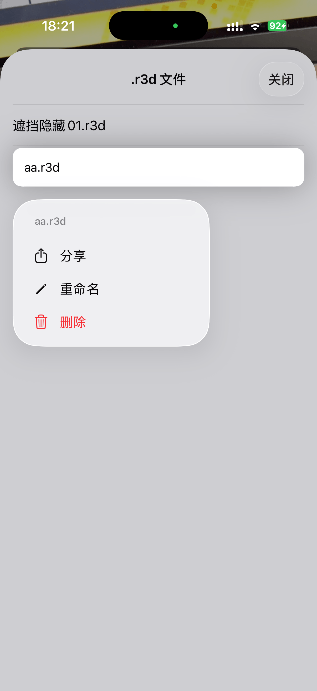

# plan1 工程分析文档

> 分析日期: 2026-06-05
> 项目说明: 基于 ARKit + SceneKit 的 iOS 空间扫描与 Record3D 导出工具

## 效果展示

<p align="center">
  
  
  
</p>

---

## 一、项目概述

一个 iOS AR 扫描工具，利用 iPhone 的 LiDAR 传感器进行实时场景重建（网格线框），同时采集 RGB 图像、深度图（smoothedSceneDepth）和置信度图，最终导出为标准 **Record3D (.r3d)** 格式，供三维重建或可视化工具使用。

### 技术栈

| 层面 | 技术 |
|---|---|
| 语言 | Objective-C |
| AR 框架 | ARKit (ARWorldTrackingConfiguration + 场景重建) |
| 3D 渲染 | SceneKit (ARSCNView) |
| 数据压缩 | LZFSE (`<compression.h>`) + zlib (CRC-32) |
| 图片处理 | CoreImage (CIImage crop + scale + JPEG) |

---

## 二、目录结构与模块职责

```
plan1/
├── AppDelegate.h/m          # 应用生命周期，UIScene 管理
├── SceneDelegate.h/m        # 场景生命周期（标准模板）
├── ViewController.h/m       # 🎯 主控制器 — 协调 AR 会话 + 扫描流程 + UI
├── main.m                   # 入口
├── Render/
│   └── MeshRenderer.h/m     # AR 网格 → SCNGeometry 转换，线框渲染 + 深度遮挡
├── UI/
│   ├── ScanControlButton.h/m    # 奶绿/奶红色两态扫描按钮
│   └── FileListViewController.h/m # .r3d 文件列表 + 长按菜单
├── Data/
│   ├── FrameRecord.h/m       # 单帧数据结构模型
│   ├── ScanDataManager.h/m   # 帧采集生命周期 + 数据压缩（后台队列）
│   └── R3DExporter.h/m       # FrameRecord[] → .r3d zip 导出
├── Utility/
│   └── ZipWriter.h/m         # 纯手写 ZIP 写入器（无外部依赖）
└── Info.plist
```

### 模块依赖关系

```
ViewController
  ├── MeshRenderer          [渲染] ← ARSCNViewDelegate
  ├── ScanControlButton     [UI]   ← 交互事件
  ├── FileListViewController [UI]  ← 文件浏览（模态弹出）
  ├── ScanDataManager       [数据] ← 帧采集/压缩（后台队列）
  │     └── FrameRecord     [模型]
  └── R3DExporter           [导出] ← 导出时使用
        └── ZipWriter       [工具]
```

---

## 三、功能流程

### 3.1 主循环

```
viewWillAppear
  └── ARSession runWithConfiguration

renderer:updateAtTime:    (每帧回调)
  └── 如果 isScanning && frameCounter % 6 == 0
        └── dataManager.recordFrame(currentFrame)
```

### 3.2 扫描流程

```
用户点击"开始"按钮
  ├── isScanning = YES, frameCounter = 0
  ├── dataManager.startRecording()   清空上一轮帧数据
  ├── 按钮变为红色"结束"
  └── 开始采集: 每 6 帧采集一次

用户点击"结束"按钮
  ├── records = dataManager.stopRecording()  取出所有帧
  ├── 弹出命名对话框（默认 Scan_yyyyMMdd_HHmmss）
  ├── [导出] → exportR3DWithRecords:filename: → R3DExporter → ZipWriter
  ├── [取消] → 跳过导出
  └── clearScene() → ARSession 重置（removeExistingAnchors）
```

### 3.3 导出流程 (R3DExporter)

```
exportRecords:toPath:
  ├── ZipWriter 初始化（创建 .r3d 文件）
  ├── 添加 metadata JSON:
  │     ├── fps (按 first/last.timestamp 计算)
  │     ├── dw/dh (从 first.depthWidth/Height 读取)
  │     ├── w/h (720×960)
  │     ├── K (相机内参矩阵 3×3)
  │     ├── initPose (第一帧位姿 [tx,ty,tz, qx,qy,qz,qw])
  │     ├── frameTimestamps (相对时间戳数组)
  │     ├── poses (每帧位姿数组)
  │     └── perFrameIntrinsicCoeffs (每帧内参 [fx,fy,cx,cy])
  ├── 添加 icon（第一帧 JPEG）
  ├── 逐帧添加 rgbd/{N}.jpg / rgbd/{N}.depth / rgbd/{N}.conf
  └── zip.close() 写入 EOCD
```

---

## 四、关键设计决策

### 4.1 采集频率控制

| 项目 | 数值 |
|---|---|
| ARKit 渲染帧率 | ~30 fps (SceneKit 主循环) |
| 采集间隔 | 每 6 帧取 1 帧 |
| 实际采集帧率 | ~5 fps |

`renderer:updateAtTime:` 通过 `frameCounter % 6` 控制采样间隔，在性能与数据量之间取得平衡。

### 4.2 颜色图像处理

```
原生 CVPixelBuffer (1920×1440 或更高)
  → CIImage 旋转（横向传感器→纵向）
  → 居中裁剪（保持 720:960 宽高比）
  → 缩放至 720×960
  → JPEG 编码 (quality 0.85)
  → NSData 存入 FrameRecord
```

RGB 输出规格：720×960 JPEG。原始数据太大（~2.76MB / frame at 720×960 BGRA）不在内存中保留，采集时直接 JPEG 压缩。

### 4.3 深度/置信度压缩

- **深度图**: 256×192 float32 (196KB/frame) → LZFSE → ~50KB
- **置信度图**: 256×192 uint8 (48KB/frame) → LZFSE → ~10KB

两项均在采集时完成压缩，因为数据量小（LZFSE 仅需 ~1-2ms），内存收益显著。

### 4.4 网格渲染与深度遮挡 (MeshRenderer)

```
ARMeshAnchor.geometry (ARMeshGeometry)
  → 逐顶点拷贝 (SCNVector3, 补偿 stride)
  → 逐索引拷贝 (int, 三角形)
  → SCNGeometrySource + SCNGeometryElement
  → SCNGeometry + SCNMaterial
  → 锚点节点下挂两个子节点:
       ① 遮挡体 (solid fill, 写深度, 只写 alpha 通道)
       ② 线框 (fillMode=Lines, emission 白色)
  → renderingOrder: 遮挡体=0, 线框=1
```

**为什么用 emission.contents 而不是 diffuse.contents？**

线框模式 (`SCNFillModeLines`) 下没有法线信息，光照计算的 `dot(N,L)` 始终为 0，`diffuse` 显示为黑色。改用 `emission` 可绕过光照直接显示颜色。

**深度遮挡原理**

每个 ARMeshAnchor 节点下挂两个子节点：
1. **遮挡体**（renderingOrder=0，先渲染）— 实体三角形填充，只写 alpha 通道（无 RGB 可见输出），`writesToDepthBuffer=YES`，填充深度缓冲区
2. **线框**（renderingOrder=1，后渲染）— `SCNFillModeLines` 边线模式，`writesToDepthBuffer=NO`，深度测试自动隐藏被前面实体表面挡住的线

这样桌面后面的地面网格线就不会显示，实现了前后遮挡效果。

### 4.5 异步采集

JPEG + LZFSE 压缩派发到串行后台队列 `com.plan1.scanprocessing`，主线程只做元数据提取（pose、内参、时间戳），避免主线程卡顿。

线程安全措施：
- `CVPixelBufferRetain`/`Release` 保证 pixel buffer 在异步期间存活
- `@synchronized(self)` 保护 `records` 数组
- `startRecording`/`stopRecording` 先 `dispatch_sync` 等待后台处理完成

### 4.6 ZIP 写入器 (ZipWriter)

纯手写标准 ZIP 格式，不依赖任何第三方库：

| 区域 | 内容 |
|---|---|
| Local File Header (×N) | 签名 0x04034b50 + 元数据 + 文件名 + 文件数据 |
| Central Directory (×N) | 签名 0x02014b50 + 元数据 + 偏移量 |
| End of Central Directory | 签名 0x06054b50 + 总计条目数 + CD 偏移 |

- 压缩方式: **Stored** (不压缩，因为 depth/conf 已在数据层预压缩)
- CRC-32: 使用 `<zlib.h>` 的 `crc32()`
- 文件名 UTF-8 编码

### 4.7 清空场景的坑

`clearScene` 不要手动 `removeFromParentNode` 后再 `runWithConfiguration:removeExistingAnchors`，否则 SceneKit 内部链表指针会损坏（child 已从树中移除但 ARKit 仍尝试管理），导致断言失败崩溃。**直接调用 session restart 即可**，ARKit 会自动清理所有锚点及对应节点。

### 4.8 导出文件名

- 默认格式: `Scan_yyyyMMdd_HHmmss.r3d`
- 用户可在弹窗中修改
- 自动补 `.r3d` 后缀
- 空文件名兜底: Unix 时间戳

---

## 五、数据模型

### FrameRecord

| 字段 | 类型 | 说明 |
|---|---|---|
| timestamp | NSTimeInterval | ARFrame.timestamp |
| position | simd_float3 | 相机位置 (Tx, Ty, Tz) |
| quaternion | simd_quatf | 旋转四元数 (qx, qy, qz, qw) |
| intrinsics | simd_float3x3 | 相机内参矩阵 |
| depthWidth | size_t | 深度图实际宽度 (CVPixelBufferGetWidth) |
| depthHeight | size_t | 深度图实际高度 (CVPixelBufferGetHeight) |
| jpegData | NSData * | 720×960 JPEG 编码颜色图 |
| depthData | NSData * | LZFSE 压缩 float32 深度图 |
| confidenceData | NSData * | LZFSE 压缩 uint8 置信度图 |

---

## 六、Record3D 格式映射

项目输出兼容 Record3D 格式：

```
.r3d (ZIP)
├── metadata              JSON: fps, w, h, dw, dh, K, initPose, frameTimestamps, poses, perFrameIntrinsicCoeffs, cameraType
├── icon                  JPEG (第一帧)
└── rgbd/
    ├── 0.jpg             JPEG 颜色帧
    ├── 0.depth           LZFSE 压缩 float32 深度
    ├── 0.conf            LZFSE 压缩 uint8 置信度
    ├── 1.jpg
    ├── 1.depth
    ├── 1.conf
    └── ...
```

### 格式说明

| 字段 | 来源 | 说明 |
|---|---|---|
| dw/dh | `CVPixelBufferGetWidth/Height(depthMap)` | 实际深度图尺寸，不再硬编码 |
| cameraType | 1 (Back) | 后置相机 |
| w/h | 720×960 | 固定 RGB 输出尺寸 |
| K | `frame.camera.intrinsics` | 3×3 内参矩阵 |
| poses | 从 `camera.transform` 分解 | [tx, ty, tz, qx, qy, qz, qw] |

---

## 七、性能考量

| 操作 | 耗时（估） | 执行时机 | 优化 |
|---|---|---|---|
| JPEG crop + scale + encode | ~30-50ms | 后台串行队列（~5 fps） | 后台队列异步执行 |
| LZFSE depth (196KB) | ~1-2ms | 后台串行队列 | 数据量小 |
| LZFSE confidence (48KB) | ~<1ms | 后台串行队列 | 数据量小 |
| ZIP 写入 | 导出时 | 用户等待 | 可接受 |
| MeshRenderer 几何体创建 | ~2-5ms | didAddNode / didUpdateNode | 每个锚点只创建一次 |
| 深度遮挡渲染 | ~<1ms 额外 | 每帧 | 遮挡体使用 fill 模式（比线框还快） |

**内存**:
- `records: NSMutableArray<FrameRecord *>` — 每帧 ~150KB (JPEG) + ~60KB (LZFSE depth+conf) ≈ 210KB
- 3 分钟扫描 (5fps) ≈ 900 帧 ≈ **~185MB** 峰值
- 导出后全部释放

---